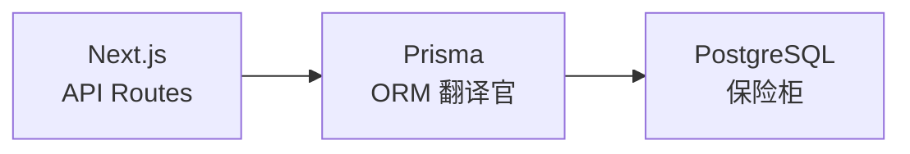

---
{"dg-publish":true,"permalink":"/ai-web-knowledge/1/","noteIcon":""}
---

# 1. 架构设计与技术选型

> 在动手写代码之前，先理解"为什么选这些技术"以及"它们如何配合"。本章帮你建立全局视角。

---

## 1.1 技术栈全景

本项目的技术栈选择并非随意组合，而是形成了一个**互为补充的全栈闭环**：

| 层次 | 技术选型 | 核心职责 | 为什么选它 |
|------|----------|----------|------------|
| **前端框架** | Next.js (App Router) | 页面渲染 + API 路由 + BFF | React Server Components、文件系统路由、全栈同构 |
| **样式方案** | Tailwind CSS | 原子化样式 | 约束即设计，AI 擅长写 Tailwind 类名 |
| **ORM** | Prisma | 数据库操作层 | 类型安全，自动补全，无需手写 SQL |
| **身份认证** | NextAuth.js | 邮箱 + OAuth 登录 | 零费用，用户数据不外流 |
| **数据库** | PostgreSQL 15 | 持久化存储 | 成熟稳定，生态丰富 |
| **反向代理** | Nginx | 流量分发、HTTPS | 单服务器多站点、安全隔离 |
| **容器化** | Docker Compose | 环境封装与编排 | "一次构建，到处运行" |

## 1.2 为什么 Next.js 是 2026 年的全栈首选？

### 核心优势

Next.js 不仅仅是 React 框架，它是一个**基于 Rust 编译器（Turbopack）构建的元框架**，解决了传统 SPA（单页应用）的核心局限：

| 特性 | 解决的问题 | 实际价值 |
|------|------------|----------|
| **混合渲染** | SPA 首屏白屏、SEO 差 | 同一应用混用 SSR/SSG/PPR |
| **React Server Components** | 客户端 JS 体积膨胀 | 组件在服务端渲染，减少发送到浏览器的代码 |
| **文件系统路由** | 手动维护路由繁琐 | 文件夹结构直接映射为 URL |
| **API Routes** | 需要独立后端项目 | UI 与 API 在同一个项目中开发 |

### 初始化命令

```bash
npx create-next-app@latest frontend
```

**原理说明**：
> - **`npx`**：临时下载并执行 `create-next-app` 包，执行完后自动删除，不污染全局安装
> - **`frontend`**：创建子目录而非根目录安装，是为了践行**关注点分离**：
>   - 避免 `node_modules` 与 Python 虚拟环境 (`venv`) 冲突
>   - CI/CD 时可独立指定根目录为 `frontend`，便于独立构建
>
> 这是 **Monorepo（单仓多项目）** 的初级形态。

### 交互式配置的工程决策

安装过程中选择默认设置（TypeScript + Tailwind + App Router + ESLint），背后是一套**强类型、原子化、服务端优先**的技术栈：

| 配置项 | 作用 | 底层逻辑 |
|--------|------|----------|
| **TypeScript** | 静态类型检查 | 编译时发现类型错误，降低运行时崩溃风险 |
| **Tailwind CSS** | 原子化 CSS | 通过约束限制样式范围，避免 CSS 污染 |
| **App Router** | React 18+ 流式渲染 | 支持嵌套布局、服务端组件、流式传输 |
| **ESLint** | 静态代码分析 | 在提交前发现潜在错误 |

### 安装时的后台动作

执行命令后，`create-next-app` 在后台执行了以下生命周期：

1. **Scaffolding（脚手架构建）**：从官方仓库下载最新 App Router 模板
2. **Dependency Resolution（依赖解析）**：`npm install` 安装 `next`、`react`、`react-dom` 等依赖
3. **Config Generation（配置生成）**：
   - `tsconfig.json`：配置模块解析与路径别名（`@/*` 指向项目根目录）
   - Tailwind 配置：扫描 `app/` 目录下的类名
4. **Git Initialization**：执行 `git init` 并创建 `.gitignore`

---

## 1.3 项目结构规约

安装完成后，生成的目录结构如下：

```
ai-web-community/
├── docker-compose.yml          # Docker 编排（定义 3-4 个容器的协作）
├── .env.example                # 环境变量模板（敏感信息的"面具"）
├── .env                        # 真实环境变量（不入 Git）
│
├── frontend/                   # Next.js 前端主目录
│   ├── app/                    # App Router：文件夹=URL路径
│   │   ├── layout.tsx          # 根布局（包含<html><body>，切换页面不重绘）
│   │   ├── page.tsx            # / → 首页
│   │   ├── api/                # 后端 API 路由
│   │   │   ├── auth/           # 认证相关
│   │   │   ├── courses/        # 课程 CRUD
│   │   │   └── health/         # 健康检查
│   │   └── login/ register/... # 更多页面
│   ├── components/             # 可复用 React 组件
│   ├── lib/                    # 工具函数和服务层（Prisma、Auth、Resend 等）
│   ├── prisma/                 # 数据库模式定义与迁移
│   │   ├── schema.prisma       # 数据模型（"终极说明书"）
│   │   ├── migrations/         # 数据库版本演进史
│   │   └── seed.ts             # 种子数据
│   ├── public/                 # 静态资源（/logo.svg 直接访问）
│   ├── Dockerfile              # 前端容器构建配置
│   └── entrypoint.sh           # 容器启动脚本（先跑数据库迁移，再启动服务）
│
├── nginx/
│   └── nginx.conf              # 反向代理配置
│
└── backups/                    # 数据备份目录
```

### 核心配置文件的角色

| 文件 | 作用 | 底层逻辑 |
|------|------|----------|
| **`package.json`** | 项目清单 | 定义依赖、脚本命令（`dev`/`build`/`start`） |
| **`tsconfig.json`** | TypeScript 配置 | `paths` 中 `@/*` 指向根目录，简化导入路径 |
| **`tailwind.config.*`** | 原子化 CSS 配置 | 扫描 `app/` 下类名，生成最小化 CSS |
| **`next.config.*`** | Next.js 引擎配置 | 环境变量、图片域名白名单、重写规则 |

---

## 1.4 四容器全栈部署架构

本项目的核心架构理念是**微服务化**——将 Web 应用拆分为 3-4 个功能独立的 Docker 容器，通过 Docker Compose 统一编排。

### 容器职责

| 容器 | 技术选型 | 类比 | 核心职责 |
|------|----------|------|----------|
| **Nginx** | `nginx:stable-alpine` | 大楼保安 | 反向代理、SSL 管理、流量分发、静态缓存 |
| **Frontend** | `Next.js (Node.js)` | 门面担当 | 用户界面 + API Routes（轻量后端） |
| **Backend**（可选） | `FastAPI (Python)` | 重型大脑 | 复杂业务计算、AI 算法（按需扩展） |
| **Database** | `PostgreSQL 15` | 地下金库 | 持久化存储用户与业务数据 |

### 为什么需要四层分离？

每一层都在解决特定的问题：

**为什么需要 Nginx？**
> 不让 Next.js 直接暴露在公网。Nginx 像一个"传达室"——公网流量只打到 Nginx，由它决定转发给谁。好处：
> - **安全**：攻击 80 端口面对的是 Nginx，不是你的业务代码
> - **多站点**：同一台服务器可运行多个项目，Nginx 根据域名分发

**为什么 Frontend 和 Backend 分开？**
> Next.js 的 API Routes 适合处理轻量逻辑（点赞、评论），但复杂的 AI 计算或大数据处理应交由专门的 Backend 容器，避免阻塞前端渲染。

**为什么数据库不暴露端口？**
> 数据库只对内部容器开放，不映射宿主机端口。只有处于同一 Docker 网络下的容器能访问，**物理切断**了来自外网的数据库攻击。

### 容器间通信逻辑

在 Docker 内部网络中，容器通过**服务名**而非 IP 通信（Service Discovery）：

```
前端 → 后端：    http://backend:8000/api
后端 → 数据库：  postgresql://user:password@db:5432/dbname
外部 → 服务：    用户 → 服务器 80 端口 → Nginx → 转发给对应容器
```

### Docker Compose 部署蓝图

```yaml
# docker-compose.yml
version: '3.8'

services:
  db:                          # 数据库：不暴露端口，仅内部使用
    image: postgres:15
    environment:
      POSTGRES_USER: user
      POSTGRES_PASSWORD: password
    volumes:
      - db_data:/var/lib/postgresql/data
    networks:
      - app-network

  frontend:                    # 前端：需要构建，依赖数据库
    build: ./frontend
    depends_on:
      - db
    networks:
      - app-network

  nginx:                       # Nginx：唯一对外暴露的入口
    image: nginx:stable-alpine
    ports:
      - "80:80"
    volumes:
      - ./nginx.conf:/etc/nginx/nginx.conf:ro  # :ro = 只读挂载，安全
    depends_on:
      - frontend
    networks:
      - app-network

networks:
  app-network:
    driver: bridge

volumes:
  db_data:
```

**原理说明**：
> - **`depends_on`**：Docker Compose 根据依赖关系决定启动顺序，先起 DB 再起 Frontend
> - **`:ro`（只读挂载）**：Nginx 容器只能读取配置文件，不能修改，增加安全性
> - **`app-network`**：Docker 自动创建一个隔离网络，容器间通过服务名即可通信
> - **`volumes`**：将容器内数据库文件映射到宿主机硬盘，容器销毁数据不丢

---

## 1.5 Prisma：让数据库"透明化"

Prisma 是连接 Next.js 和 PostgreSQL 的桥梁，它解决了手动拼写 SQL 的两大痛点：**类型不安全**和**容易写错字段名**。

### 角色定位



- **Prisma** 运行在服务端（Node.js），绝不能在浏览器客户端运行
- 它把 SQL 查询抽象为 JavaScript 函数调用：`prisma.user.findMany()` 替代 `SELECT * FROM users`
- 配合 TypeScript 拥有完整的**自动补全**，几乎不会写错字段名

### 核心工作流

```bash
# 1. 定义数据模型 → 修改 schema.prisma
# 2. 生成类型安全的 Prisma 客户端
npx prisma generate

# 3. 将模型同步到数据库（开发阶段）
npx prisma db push

# 4. 生成正式的迁移脚本（生产环境用）
npx prisma migrate dev

# 5. 可视化修改数据（像 Excel 一样操作数据库）
npx prisma studio
```

**原理说明**：
> - **`prisma generate`**：读取 `schema.prisma`，生成 TypeScript 类型定义和客户端代码
> - **`prisma db push`**：直接将模型同步到数据库，适合快速开发迭代
> - **`prisma migrate dev`**：对比当前数据库状态与 `schema.prisma`，生成 SQL 迁移脚本
> - **`prisma studio`**：在浏览器打开 `http://localhost:5555`，提供 Web 版 Excel 界面

---

## 1.6 项目启动与访问（可复现操作）

每次打开项目后，都需要启动开发服务器。以下是标准步骤：

### 步骤 1：进入前端项目目录

```bash
cd ai-web-community/frontend
```

**原理说明**：
> Next.js 的 `package.json` 和 `node_modules` 都在 `frontend` 子目录，必须先 `cd` 进去，否则 `npm` 命令找不到配置。

### 步骤 2：安装依赖（首次或依赖变更时）

```bash
npm install
```

**原理说明**：
> - 读取 `package.json` 中声明的依赖，从 npm registry 下载到 `node_modules/`
> - **首次克隆项目**、**修改了 `package.json`**、**删除了 `node_modules`** 后必须执行

### 步骤 3：启动开发服务器

```bash
npm run dev
```

**终端输出示例**：
```
📱 手机访问（同一 WiFi 下）: http://172.19.22.228:3000

▲ Next.js 16.1.6 (Turbopack)
- Local:    http://localhost:3000
- Network:  http://0.0.0.0:3000  ← 切勿用这个地址访问！
✓ Ready in 3.3s
```

**原理说明**：
> - **`npm run dev`** 执行 `package.json` 中 `scripts.dev` 定义的命令
> - 本项目自定义了 `dev` 脚本，先执行 `node scripts/dev.mjs` 打印手机访问地址，再启动 `next dev --hostname 0.0.0.0`
> - **`--hostname 0.0.0.0`**：让 Next.js 监听所有网卡，手机（同一 WiFi）才能访问
> - **`http://0.0.0.0:3000` 不可用于浏览器访问**，会返回 502。请使用 `📱 手机访问` 后的实际 IP 地址

### 步骤 4：浏览器访问

```bash
# 本机访问
http://localhost:3000

# 手机访问（同一 WiFi）
http://172.19.22.228:3000  # 以终端显示的 IP 为准
```

### 常用 npm 脚本

| 命令 | 作用 | 底层逻辑 |
|------|------|----------|
| `npm run dev` | 启动开发服务器 | `next dev --hostname 0.0.0.0`，热更新 |
| `npm run build` | 构建生产版本 | `next build`，输出到 `.next/` 目录 |
| `npm run start` | 运行生产版本 | `next start`，需先 `npm run build` |
| `npm run lint` | 代码检查 | ESLint 检查语法和潜在问题 |

---

## 1.7 架构核心原则总结

1. **关注点分离**：每个容器只做一件事，做好一件事
2. **类型安全**：TypeScript + Prisma 提供端到端的类型保障
3. **容器化封装**：代码 + 环境 = 镜像，确保"本地能跑，服务器就能跑"
4. **单向依赖**：Nginx → Frontend → Database，避免循环依赖
5. **数据持久化**：所有有状态数据通过 Volume 挂载到宿主机

---

**← [[ai-web-knowledge/MOC-AI全栈开发部署知识库\|返回知识库]]** | **→ [[ai-web-knowledge/2-开发环境与工作流\|下一篇：开发环境与工作流]]**
