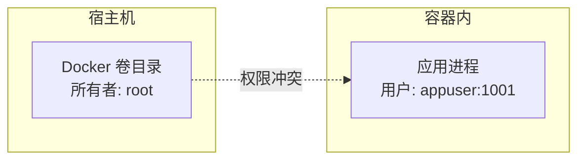

---
{"dg-publish":true,"permalink":"/ai-web-knowledge/4-docker/","noteIcon":""}
---


# 4. 服务器环境搭建与 Docker 安装

> 在部署代码之前，先让服务器"准备好"。本章从环境检查开始，覆盖 Docker 安装的三种方案（标准/镜像/插件）以及常见的卷权限问题。

---

## 4.1 服务器环境"大体检"

在安装任何软件前，先摸清服务器的底细：

### 体检命令

```bash
# 1. 查看操作系统版本
cat /etc/os-release

# 2. 检查是否已有旧版 Docker
docker -v
docker-compose -v

# 3. 网络连通性测试（是否能连外部仓库）
ping -c 3 google.com
```

**原理说明**：
> - `cat /etc/os-release`：显示操作系统名称和版本号，确认环境是预期中的 OpenCloudOS/CentOS/Ubuntu
> - 检查存量 Docker：避免重复安装导致版本冲突
> - 网络测试：国内服务器连 GitHub/Docker Hub 经常超时，需提前评估是否需要镜像加速

### 系统检查清单

| 检查项 | 命令 | 预期结果 |
|--------|------|----------|
| 系统版本 | `cat /etc/os-release` | OpenCloudOS 9 / Ubuntu 22.04 等 |
| CPU | `nproc` | >= 2 核 |
| 内存 | `free -h` | >= 4GB |
| 磁盘 | `df -h` | >= 20GB 可用 |
| 网络 | `ping -c 3 google.com` | 有响应或明确超时 |

---

## 4.2 Docker 引擎安装（三种方案）

根据服务器网络状况选择最适合的方案。

### 方案 A：标准安装（网络畅通时）

这是 Ubuntu 系统的标准安装流程：

```bash
# 1. 更新软件源
sudo apt-get update

# 2. 安装依赖工具
sudo apt-get install -y ca-certificates curl gnupg

# 3. 安装 Docker
sudo apt-get install -y docker.io docker-compose

# 4. 启动 Docker 并设置开机自启
sudo systemctl start docker
sudo systemctl enable docker

# 5. 验证
docker -v
docker-compose -v
```

**原理说明**：
> - `systemctl enable docker`：这是生产环境的"保命符"。服务器意外重启后，Docker 守护进程会自动启动，容器也会自动恢复
> - `-y` 参数：自动确认，避免交互式安装时卡住
> - `docker.io`：Ubuntu 官方仓库中的 Docker 引擎包名

### 方案 B：使用阿里云镜像源（网络受阻时）

当官方源连接超时（`Connection reset by peer`），切换至国内镜像仓库：

```bash
# 1. 安装依赖工具（CentOS/OpenCloudOS 用 dnf）
sudo dnf install -y dnf-utils

# 2. 使用阿里云镜像源添加 Docker 仓库
sudo dnf config-manager --add-repo http://mirrors.aliyun.com/docker-ce/linux/centos/docker-ce.repo

# 3. 安装 Docker
sudo dnf install -y docker-ce docker-ce-cli containerd.io

# 4. 启动
sudo systemctl start docker
sudo systemctl enable docker
```

**原理说明**：
> - 替换 `download.docker.com` 为 `mirrors.aliyun.com`，利用国内骨干网提速
> - `docker-ce`：Community Edition（社区版），功能和稳定性对企业级开发完全够用
> - `containerd.io`：容器运行时，负责管理容器生命周期

### Docker Compose 独立版安装

```bash
# 官方链接（网络好时）
sudo curl -L "https://github.com/docker/compose/releases/download/v2.24.5/docker-compose-$(uname -s)-$(uname -m)" -o /usr/local/bin/docker-compose

# 国内加速（使用 DaoCloud 镜像）
sudo curl -L "https://get.daocloud.io/docker/compose/releases/download/v2.24.5/docker-compose-$(uname -s)-$(uname -m)" -o /usr/local/bin/docker-compose

# 赋予执行权限
sudo chmod +x /usr/local/bin/docker-compose

# 验证
docker-compose -v
```

### 方案 C：Docker Compose 插件化安装（最推荐）

如果独立版二进制文件持续下载失败，推荐使用插件模式——这是最稳定、维护成本最低的方式：

```bash
# 1. 直接安装插件（从配置好的镜像源下载）
sudo dnf install -y docker-compose-plugin

# 2. 验证（注意：插件版是空格，不是连字符）
docker compose version
```

**原理说明**：
> - **独立版 vs 插件版**：
>   - 独立版：调用命令为 `docker-compose`（带连字符），需额外下载二进制文件
>   - 插件版：调用命令为 `docker compose`（空格），随 Docker 一起管理
> - 本项目兼容两种调用方式，推荐使用插件版（空格写法）

---

## 4.3 配置 Docker 镜像加速器

当你执行 `docker compose up` 时，报错 `i/o timeout` 是因为 Docker 默认去美国官方仓库下载镜像。

```bash
# 1. 创建 Docker 配置目录
sudo mkdir -p /etc/docker

# 2. 编辑加速器配置
sudo vi /etc/docker/daemon.json
```

写入以下内容：

```json
{
  "registry-mirrors": [
    "https://mirror.ccs.tencentyun.com",
    "https://2a0tua90.mirror.aliyuncs.com"
  ]
}
```

```bash
# 3. 重启 Docker 服务（激活配置）
sudo systemctl daemon-reload
sudo systemctl restart docker
```

**原理说明**：
> - **`/etc/docker/daemon.json`**：Docker 守护进程的全局配置文件。这里的修改对整台服务器的所有 Docker 行为生效
> - **`registry-mirrors`**：告诉 Docker "如果官方仓库连不上，请自动去国内镜像站下载"
> - **`daemon-reload`**：通知系统内核重新扫描配置文件
> - **`restart docker`**：重启 Docker 守护进程，只有重启新配置才会生效
> - 配置前拉取一个镜像可能 **30 分钟超时**，配置后只需 **30 秒**

---

## 4.4 Docker 卷挂载权限问题完全指南

### 问题现象

在容器化 Web 应用中，文件上传后经常遇到"权限拒绝"（Permission Denied）：

```
典型场景：
1. 本地开发：文件上传功能正常
2. Docker 环境：上传后无法立即访问
3. 重启容器后：文件又能正常显示
```

### 根本原因



**原理说明**：
> - Docker 卷（Volume）的数据目录在宿主机上所有者是 `root:root`
> - 容器内应用以非 root 用户（如 `appuser:1001`）运行
> - 当容器内用户写文件到卷时，文件权限由容器内 UID 决定
> - 但其他进程（如 Nginx）读取时可能因权限不匹配而失败
> - **本质是容器内外用户 ID 映射冲突**

### 权限继承链的断裂

```
本地文件 → 容器构建 → 卷挂载 → 运行时写入 → 其他进程读取
   755        755     可能变root    644         可能无权限
```

### 解决方案对比

| 方案 | 复杂度 | 适用场景 | 说明 |
|------|--------|----------|------|
| **方案1：entrypoint 脚本修复** | ⭐ 低 | 当前项目正使用 | 容器启动时 `chown` 修复权限 |
| **方案2：固定 UID/GID** | ⭐⭐ 中 | 生产环境 | 容器内外使用一致的 UID |
| **方案3：绑定挂载** | ⭐ 低 | 开发环境 | 目录直接映射到宿主机 |

#### 方案 1：entrypoint 脚本修复（推荐，当前项目使用）

```bash
#!/bin/sh
# frontend/entrypoint.sh
set -e

# 在容器启动时强制修复权限
chown -R appuser:appgroup /app/uploads
chmod -R 755 /app/uploads

# 执行数据库迁移
npx prisma migrate deploy

# 启动应用
exec node server.js
```

**原理说明**：
> - `set -e`：任何命令失败立即退出，防止在错误状态下运行
> - 每次容器启动时重新设置权限，确保无论卷的状态如何，应用都有正确权限
> - 这是一种"治标但有效"的方法，胜在简单可靠

#### 方案 2：Dockerfile 预配置权限

```dockerfile
# 在构建时创建具有正确权限的目录
RUN mkdir -p /app/uploads && \
    chown -R appuser:appgroup /app/uploads && \
    chmod -R 755 /app/uploads

# entrypoint 以 root 运行初始设置后切换到应用用户
USER root
COPY entrypoint.sh /entrypoint.sh
RUN chmod +x /entrypoint.sh
ENTRYPOINT ["/entrypoint.sh"]

USER appuser
```

#### 方案 3：docker-compose 中指定用户 ID

```yaml
services:
  frontend:
    user: "1001:1001"  # 显式指定容器运行时用户
    volumes:
      - uploads_data:/app/public/uploads
    # user: "${UID:-1000}:${GID:-1000}"  # 或与宿主机同步
```

### 最佳实践建议

**设计阶段的权限规划**：

```
/app/uploads/
├── avatars/     # 755, appuser:appgroup
├── covers/      # 755, appuser:appgroup
├── temp/        # 777, 临时文件
└── processed/   # 750, 处理后的文件
```

**核心原则**：
1. **最小权限**：只给应用所需的最小权限
2. **明确所有权**：固定 UID/GID，避免跨环境冲突
3. **自动化修复**：entrypoint 脚本作为最后一道防线
4. **设计优于修复**：提前规划权限策略，避免后期打补丁

---

**← [[ai-web-knowledge/MOC-AI全栈开发部署知识库\|返回知识库]]** | **→ [[ai-web-knowledge/5-从代码到云端的部署实战\|下一篇：部署实战]]**
