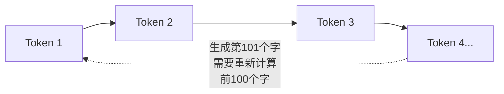

---
{"dg-publish":true,"permalink":"/ai-web-knowledge/8-ai/","noteIcon":""}
---


# 8. 扩展知识：边缘计算与 AI 缓存

> 本章深入底层原理，理解"边缘计算"和"大模型 KV Cache"的核心机制。这些知识帮助你更好地理解部署架构中的性能优化逻辑。

---

## 8.1 边缘计算（Edge Computing）

### 核心哲学：从"长途运输"到"同城快送"

**边缘计算**不是单一技术，而是一种**分布式计算架构**：将计算和数据存储从远端的中心机房，迁移到网络边缘的节点上。

| 模式 | 类比 | 延迟 | 典型场景 |
|------|------|------|----------|
| **传统云计算** | 所有快递都去总仓发货 | 200ms+ | 传统 Web 应用 |
| **边缘计算** | 同城仓发货 | 10-50ms | CDN、IoT、AI 推理 |

### 解决的三大核心痛点

**1. 物理时延（Latency）**
> 即便在理想光纤中，光速也是有限的。北京到洛杉矶的往返延迟（RTT）通常在 200ms 以上。边缘计算通过缩短空间距离，将延迟降至 **10ms - 50ms**。

**2. 网络拥塞与带宽成本（Bandwidth）**
> 如果全球 IoT 设备都将原始数据传回中心机房，骨干网将瘫痪。边缘计算在本地处理 99% 的无效数据，仅上传 1% 的关键结果。

**3. 主服务器负载（Server Load）**
> 通过在全球节点分担简单逻辑运算，主服务器从重复请求中解脱，专注于核心数据管理。

### 架构原理：它是如何实现"全球分身"的？

#### 静态资源的"按需缓存"

```
首次访问（冷启动）：
河北用户请求 → 北京边缘节点发现没缓存 → 去源站拉取 → 返回给用户并在本地存一份

二次访问（命中）：
第二个河北用户请求 → 北京节点直接返回缓存 → 无需跨海

自动淘汰：
无人访问的节点 → 自动删除副本 → 释放空间给热门内容
```

**原理说明**：
> 边缘节点遵循 **LRU（最近最少使用）** 算法。每个节点独立缓存，不占用服务器存储。如果澳大利亚节点一年没人访问你的网站，它会自动删掉副本。

#### 逻辑代码（Edge Functions）的"瞬间唤醒"

Vercel 最核心的技术——**V8 Isolate Runtime**：

- 你的代码（通常几百 KB）被分发到全球边缘节点的**磁盘**中待命
- 平时代码静止不占内存，有请求时 V8 引擎在 **5ms** 内创建隔离环境运行
- 数万个用户的边缘函数共享同一台物理服务器的内存池
- 每个函数生命周期极短，运行完即释放

### 数据流转全过程

```
以河北用户访问部署在 Vercel 上的网站为例：

① DNS 调度 → 根据 IP 将解析指向最近的边缘节点（北京或香港）
② 边缘接入 → 请求到达边缘节点
③ 本地判定 → 静态页面？→ 检查缓存，命中直接返回
             动态函数？→ 在节点 CPU 中运行
④ 远程协作 → 需要查询数据库？→ 边缘节点代表你向主库发起查询
```

**注意**：边缘计算减少了"代码执行"的延迟，但"数据查询"的延迟依然存在。这就是为什么需要配合使用**边缘数据库（Edge Config）**来进一步消除这一环节。

---

## 8.2 大模型边缘缓存与 KV Cache

### 当"边缘计算"遇见"语义逻辑"

在传统 Web 开发中，缓存的是网页（HTML）；在大模型时代，缓存的对象变成了**"思考的中间产物"**。

### 什么是 KV Cache？

要理解为什么缓存能让 AI 变快、变便宜，必须理解 Transformer 推理的底层机制。

#### Transformer 的"健忘症"



**原理说明**：
> 大模型基于 **Transformer** 架构生成每一个字（Token）时，都需要"回头看"之前所有的字。生成第 101 个字时，需要对前 100 个字做 Attention 计算；生成第 102 个字时，又要重新对前 101 个字做一遍。这种重复计算是指数级的，极其浪费 GPU 算力。

#### KV Cache 的"备忘录"原理

为了不重复劳动，**KV Cache（Key-Value Cache）** 将中间结果保存到显存中：

- **无缓存**：每生成一个字都要对前面所有字做完整 Attention 计算
- **有缓存**：生成第 101 个字时，直接从显存读取前 100 个字的 KV 状态，只需计算新字

**类比**：就像做长途算术，每算一步就把中间结果记在草稿纸上。下一步直接从草稿纸读取，不用从头算起。

### 缓存命中与边缘节点的联动

#### Prompt Caching（前缀缓存）

如果你的网站有一个 5000 字的背景知识库（System Prompt）：

```
无缓存状态：
每个用户提问 → GPU 都要把 5000 字从头算一遍 → 烧钱

边缘缓存状态：
第一个用户访问 → 5000 字产生 KV Cache → 存储在边缘节点
第二个用户提问 → System Prompt 一样 → 命中缓存 → GPU 跳过 5000 字计算
```

#### 为什么缓存命中的 Token 更便宜？

**原理说明**：
> - 节省了 **Prefill（预填充）阶段**的 GPU 算力——这是推理中最耗电、最占显存带宽的环节
> - 提高了吞吐量：同样的硬件，开启 KV Cache 后可以同时服务更多用户
> - 这就是 OpenAI、SiliconFlow 给缓存命中 Token 打折的原因

### 语义缓存（Semantic Caching）

当两个用户问"类似问题"时，边缘节点通过**向量相似度**判断缓存命中：

```
① 边缘服务器接收问题 → 转化为向量（Embedding）
② 计算与缓存库中向量的余弦相似度
③ 相似度 > 0.95 → 判定为"同一意图" → 直接返回缓存回答
④ 未命中 → 转发至昂贵的 LLM 核心集群
```

**原理说明**：
> - 每个问题被转化为高维空间中的坐标点
> - 系统计算两个问题坐标之间的**余弦相似度**
> - 判断缓存和加工也是需要运算的，但这是在 **CPU 或轻量级推理卡**上进行的，成本远低于 H100 GPU

### 实践建议

> 在开发项目时，尽量保持 **System Prompt 的稳定性**。只要前缀不变，KV Cache 就能持续生效，你的 API 账单就会非常健康。

"所有的优化本质上都是在做资源置换"——空间换时间，计算换带宽，缓存换延迟。

---

**← [[ai-web-knowledge/MOC-AI全栈开发部署知识库\|返回知识库]]** | **→ [[ai-web-knowledge/9-附录：项目参考与命令手册\|下一篇：附录与命令手册]]**
